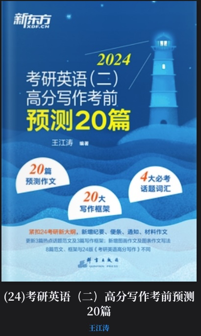

# 考研英语应用文与图表作文
# (24)考研英语（二）高分写作考前预测20篇



本目录包含考研英语写作范文、MP3 音频以及对应的 LRC 字幕文件。每个 LRC
文件与同名前缀的 MP3 文件配套，例如 `1-01-建议信.lrc` 对应
`1-01-建议信.mp3`。

## 文件清单

### 应用文

| MP3 音频 | LRC 字幕 |
| --- | --- |
| `1-01-建议信.mp3` | `1-01-建议信.lrc` |
| `1-02-邀请信.mp3` | `1-02-邀请信.lrc` |
| `1-03-推荐信.mp3` | `1-03-推荐信.lrc` |
| `1-04-介绍信.mp3` | `1-04-介绍信.lrc` |
| `1-05-道歉信.mp3` | `1-05-道歉信.lrc` |
| `1-06-感谢信.mp3` | `1-06-感谢信.lrc` |
| `1-07-便条.mp3` | `1-07-便条.lrc` |
| `1-08-通知.mp3` | `1-08-通知.lrc` |
| `1-09-告示.mp3` | `1-09-告示.lrc` |
| `1-10-纪要.mp3` | `1-10-纪要.lrc` |

### 图表与材料作文

| MP3 音频 | LRC 字幕 |
| --- | --- |
| `2-01-电子商务.mp3` | `2-01-电子商务.lrc` |
| `2-02-城市化.mp3` | `2-02-城市化.lrc` |
| `2-03-扶贫成就.mp3` | `2-03-扶贫成就.lrc` |
| `2-04-高等教育.mp3` | `2-04-高等教育.lrc` |
| `2-05-创业.mp3` | `2-05-创业.lrc` |
| `2-06-硕士招生.mp3` | `2-06-硕士招生.lrc` |
| `2-07-偶像崇拜.mp3` | `2-07-偶像崇拜.lrc` |
| `2-08-人生哲理类.mp3` | `2-08-人生哲理类.lrc` |
| `2-09-创新.mp3` | `2-09-创新.lrc` |
| `2-10-材料作文.mp3` | `2-10-材料作文.lrc` |

## 工具文件

| 文件 | 说明 |
| --- | --- |
| `add_lrc_timestamps.py` | 清理 LRC 文本、按句号和逗号拆分句子，并依据 MP3 时长生成时间戳 |
| `mp3_duration_list.csv` | MP3 文件名、完整路径和音频时长记录 |
| `cover.jpg` | 本资料封面 |

## 重新生成 LRC

在当前目录执行：

```bash
python3 add_lrc_timestamps.py
```

脚本默认更新当前目录中的 LRC，并在首次更新前生成对应的 `.lrc.bak` 备份。
如需保留原文件并输出到新目录：

```bash
python3 add_lrc_timestamps.py \
  --output-dir ./generated_lrc
```
